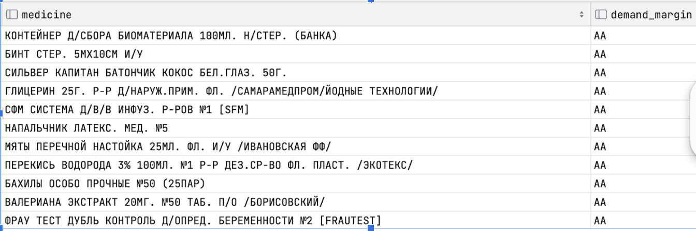
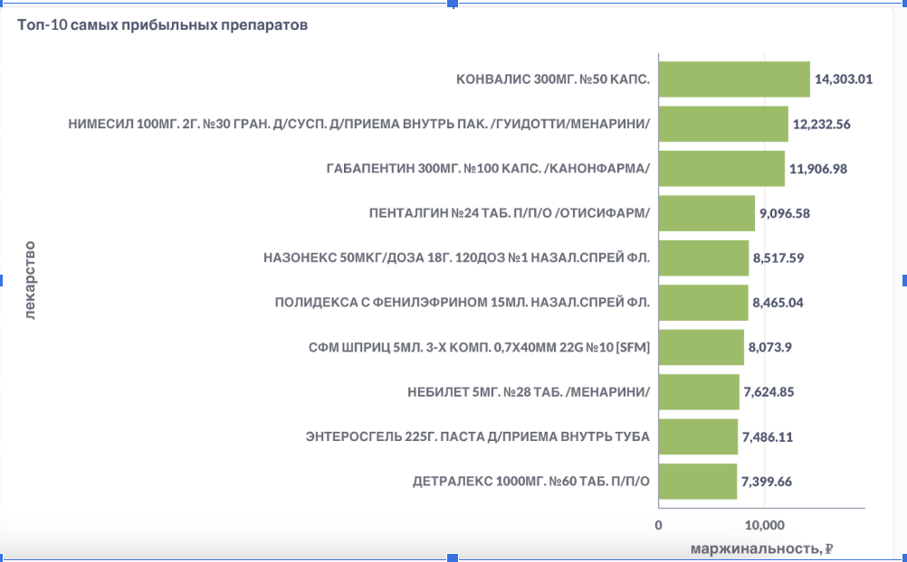
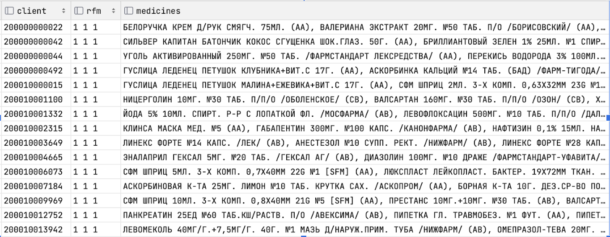

# ABC-анализ торгового склада аптечной сети

## 🎯 Цель проекта

Оценить товарный ассортимент по частоте покупок и маржинальности.  
Это поможет:
- выявить самые прибыльные и популярные препараты,
- включить их в рассылки и предложения на основе RFM-сегментов,
- оптимизировать складские запасы и маркетинговую активность.

### Выбор границ АВС-анализа для частоты покупок каждого товара:

``` sql
SELECT percentile_cont(0.4) WITHIN GROUP (ORDER BY cnt), -- 2
	   percentile_cont(0.8) WITHIN GROUP (ORDER BY cnt) -- 7
FROM (
	SELECT dr_ndrugs,
	   SUM(dr_kol) AS cnt
	FROM sales
	WHERE lower(dr_ndrugs) NOT LIKE 'карта%'
	  AND lower(dr_ndrugs) NOT LIKE 'пакет%'
	GROUP BY dr_ndrugs
	ORDER BY cnt DESC) t;

```
0.4 и 0.8 перцентили товаров по количеству их покупок равны 2 и 7 соответственно. 
40% товаров купили 2 раза или меньше за весь период в базе (1 мес), 80% товаров купили 7 раз и менее (20% товаров - более 7 покупок)
Возьмем 8 покупок и более - часто (А), 4 - не часто (В), 2 - редко (С)


### Выбор границ АВС-анализа для  маржинальности каждого товара:

``` sql
SELECT
   percentile_cont(0.2) WITHIN GROUP (ORDER BY margin_percentage)  -- 16.7 
   percentile_cont(0.8) WITHIN GROUP (ORDER BY margin_percentage)  -- 34.36 
FROM (
   SELECT
       dr_ndrugs,
       ((dr_croz - dr_czak) / NULLIF(dr_croz, 0)) * 100 AS margin_percentage
   FROM sales
   WHERE lower(dr_ndrugs) NOT LIKE 'карта%'
     AND lower(dr_ndrugs) NOT LIKE 'пакет%'
   GROUP BY dr_ndrugs, dr_croz, dr_czak
) AS t;
```
0.2 и 0.8 перцентили товаров по маржинальности равны  ~17%  и ~34% соответственно. 
20% товаров имеют наценку до 17%, 80% товаров имеют наценку менее  34% (20% товаров наценка более 34%)
Возьмем маржинальность 35% и более  - (А), 17 % и более - (В),  менее 17 %  -  (С)


## Основной запрос (покупаемость||маржинальность):

``` sql
WITH demand_margin_calc as (SELECT dr_ndrugs,
                                  SUM(dr_kol) AS cnt,
                                  CASE
                                      WHEN SUM(dr_kol) >= 8 THEN 'A'
                                      WHEN SUM(dr_kol) <= 4 THEN 'C'
                                      ELSE 'B'
                                      END AS demand_category,
                                  SUM(dr_croz - dr_czak) / NULLIF(SUM(dr_croz), 0) as percent,
                                  SUM((dr_croz - dr_czak) * dr_kol) AS total_margin, -- расчет маржи в деньгах для товара
                                  CASE
                                      WHEN CAST((SUM(dr_croz - dr_czak) / NULLIF(SUM(dr_croz), 0)) as numeric) >= 0.35
                                          THEN 'A'
                                      WHEN CAST((SUM(dr_croz - dr_czak) / NULLIF(SUM(dr_croz), 0)) as numeric) <= 0.17
                                          THEN 'C'
                                      ELSE 'B'
                                      END AS margin_category
                           FROM sales
                           WHERE lower(dr_ndrugs) NOT LIKE 'карта%'
                             AND lower(dr_ndrugs) NOT LIKE 'пакет%'
                           GROUP BY dr_ndrugs
                           ORDER BY cnt DESC)
SELECT dr_ndrugs as medicine, demand_category||margin_category as demand_margin
FROM demand_margin_calc
ORDER BY demand_margin;
```

### 📊 Пример результата запроса:


### 📊 Визуализация ТОП-10 наиболее прибыльных лекарств с возможностью сортировать по аптеке
Эти лекарства понадобятся для формирования специальных предложений:



 
Для формирования супер персонализированного предложения можно сгенерировать таблицу, где для каждого клиента с указанием его категории будут указаны товары, которые этот клиент покупал (по убыванию маржинальности). В рассылку можно включить предложения с лекарствами, которые были востребованы

``` sql
WITH max_date AS ( -- для определения давности последней покупки
   SELECT dr_bcdisc AS client, MAX(dr_dat) AS last_purchase_date
   FROM sales
   WHERE lower(dr_bcdisc) <> 'null'
   GROUP BY dr_bcdisc
),
purchases_num AS ( -- количество покупок каждого клиента
   SELECT dr_bcdisc AS client, COUNT(DISTINCT dr_dat || '' || dr_apt || '' || dr_nchk) AS purchase
   FROM sales
   WHERE lower(dr_bcdisc) <> 'null'
   GROUP BY dr_bcdisc
),
purchase_total AS ( -- сумма покупок каждого клиента
   SELECT dr_bcdisc AS client, SUM(dr_croz * dr_kol) AS total_sum
   FROM sales
   WHERE lower(dr_bcdisc) <> 'null'
   GROUP BY dr_bcdisc
),
rfm_segments AS (  -- определение сегментов по давности/частоте/сумме
   SELECT max_date.client,
          CASE WHEN ('2022-06-10' - last_purchase_date) <= 7 THEN 1
               WHEN ('2022-06-10' - last_purchase_date) < 20 THEN 2
               ELSE 3 END AS recency,
          CASE WHEN purchase >= 5 THEN 1
               WHEN purchase < 3 THEN 3
               ELSE 2 END AS frequency,
          CASE WHEN total_sum >= 2000 THEN 1
               WHEN total_sum < 500 THEN 3
               ELSE 2 END AS monetary
   FROM max_date
   JOIN purchases_num ON purchases_num.client = max_date.client
   JOIN purchase_total ON purchases_num.client = purchase_total.client
),
rfm_final AS (  -- объединение сегментов в одну буквенную комбинацию
   SELECT client, recency || ' ' || frequency || ' ' || monetary AS rfm
   FROM rfm_segments
),
demand_margin_calc AS (  -- определение покупаемости и маржинальности товаров
   SELECT dr_ndrugs,
          SUM(dr_kol) AS cnt,
          CASE WHEN SUM(dr_kol) >= 8 THEN 'A'
               WHEN SUM(dr_kol) <= 4 THEN 'C'
               ELSE 'B' END AS demand_category,
          SUM(dr_croz - dr_czak) / NULLIF(SUM(dr_croz), 0) AS margin,
          SUM((dr_croz - dr_czak) * dr_kol) AS total_margin,
          CASE WHEN CAST((SUM(dr_croz - dr_czak) / NULLIF(SUM(dr_croz), 0)) AS numeric) >= 0.35 THEN 'A'
               WHEN CAST((SUM(dr_croz - dr_czak) / NULLIF(SUM(dr_croz), 0)) AS numeric) <= 0.17 THEN 'C'
               ELSE 'B' END AS margin_category
   FROM sales
   WHERE lower(dr_ndrugs) NOT LIKE 'карта%'
   AND lower(dr_ndrugs) NOT LIKE 'пакет%'
   GROUP BY dr_ndrugs
),
best_10_medicines AS (
   SELECT dr_bcdisc AS client,
          sales.dr_ndrugs,
          demand_category || margin_category AS demand_margin,
          ROW_NUMBER() OVER (PARTITION BY dr_bcdisc ORDER BY demand_category || margin_category) AS row_num
   FROM sales
   JOIN demand_margin_calc ON sales.dr_ndrugs = demand_margin_calc.dr_ndrugs
   WHERE lower(dr_bcdisc) <> 'null'
)
-- Формируем итоговую таблицу с 10 товарами для каждого покупателя отсортированными по ‘ухудшению’ demand_margin
SELECT rfm_final.client, rfm,
      STRING_AGG(best_10_medicines.dr_ndrugs || ' (' || best_10_medicines.demand_margin || ')', ', ') AS medicines
FROM rfm_final
JOIN best_10_medicines ON rfm_final.client = best_10_medicines.client
WHERE best_10_medicines.row_num <= 10
GROUP BY rfm_final.client, rfm
ORDER BY rfm

```
### 📊 Пример результата запроса:



