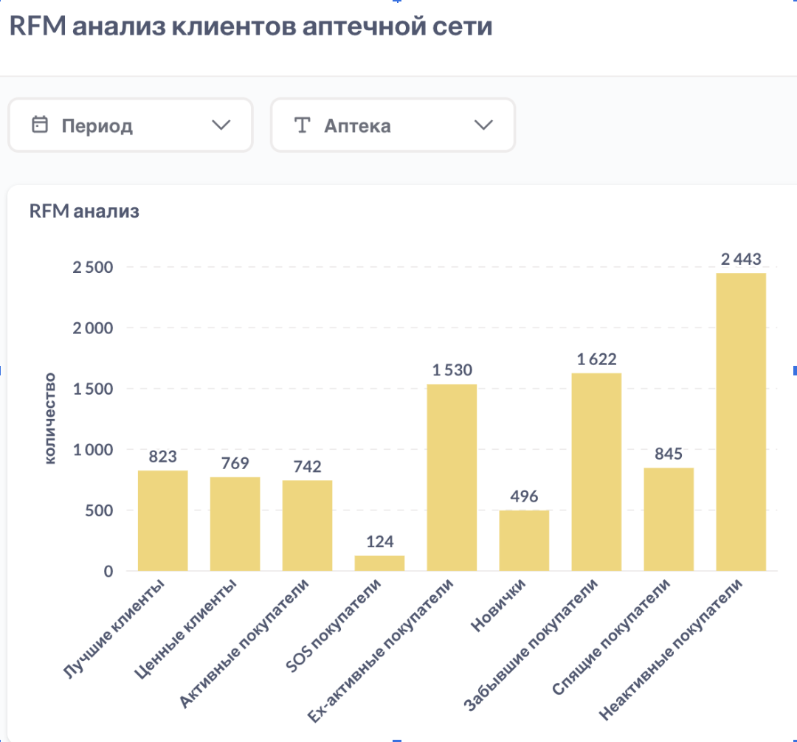
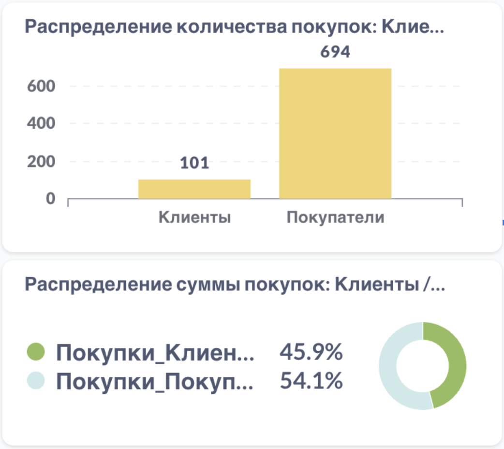
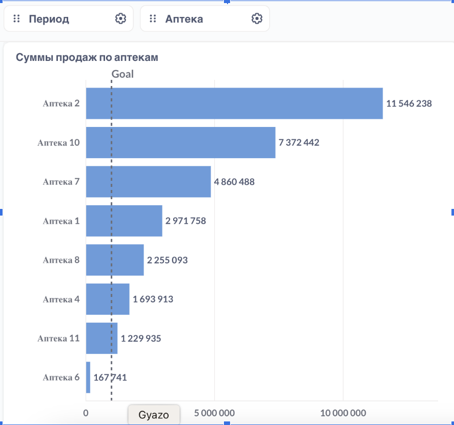

# RFM-анализ клиентов аптечной сети

## Цели анализа

- Сегментация клиентов для улучшения удержания и возврата
- Выделение наиболее ценных клиентов для программ лояльности

## Метрики

### Recency — как давно клиент был в аптеке

```sql
SELECT MIN(datetime) FROM bonuscheques; -- '2021-07-12'
SELECT MAX(dr_dat) FROM sales; -- '2022-06-09'
```

Категории:
- ≤ 30 дней — 1 (недавно)
- ≤ 100 дней — 2 (не очень давно)
- > 100 дней — 3 (давно)

### Frequency — как часто клиент покупает

```sql
SELECT
  percentile_cont(0.37) WITHIN GROUP (ORDER BY purchase_count) AS median_purchase_count
FROM (
  SELECT card AS client_id, COUNT(*) AS purchase_count
  FROM bonuscheques
  GROUP BY card
) AS client_purchase_counts;
```

Категории:
- ≥ 6 покупок — 1 (часто)
- 2–5 покупок — 2 (средне)
- < 2 покупок — 3 (редко)

### Monetary — сколько тратит клиент

```sql
SELECT
  percentile_cont(0.8) WITHIN GROUP (ORDER BY total_sum) AS high,
  percentile_cont(0.2) WITHIN GROUP (ORDER BY total_sum) AS low
FROM (
  SELECT card AS client, SUM(summ_with_disc) AS total_sum
  FROM bonuscheques
  GROUP BY card
) AS client_total_sum;
```

Категории:
- > 4500 руб — 1 (много тратит)
- 600–4500 руб — 2 (средне)
- < 600 руб — 3 (мало)

## Основной запрос для расчёта RFM-сегментов

```sql

-- расчет Recency:
WITH max_date AS (
   SELECT card AS client, CAST(MAX(datetime) as date) AS last_purchase_date -- дата последней покупки для каждого покупателя
   FROM bonuscheques
   GROUP BY card
   ),
-- расчет Frequency:
purchases_num AS (
   SELECT card AS client, COUNT(card) AS purchase -- комбинация, уникально определяющая каждый чек
   FROM bonuscheques
   GROUP BY card
   ),
-- расчет Monetary:
purchase_total AS (
   SELECT card AS client, SUM(summ_with_disc) AS total_sum
   FROM bonuscheques
   GROUP BY card
),
-- определяем RFM каждому клиенту:
rfm_segments AS (
   SELECT max_date.client,
          CASE
              WHEN ('2022-06-09' - last_purchase_date) <= 14 THEN 1
              WHEN ('2022-06-09' - last_purchase_date) < 60 THEN 2
              ELSE 3
          END AS recency,
          CASE
               WHEN purchase >= 6 THEN 1
               WHEN purchase < 2 THEN 3
               ELSE 2
          END AS frequency,
          CASE
              WHEN total_sum > 4500 THEN 1
              WHEN total_sum < 600 THEN 3
              ELSE 2
          END AS monetary
   FROM max_date
   JOIN purchases_num ON purchases_num.client = max_date.client
   JOIN purchase_total ON purchases_num.client = purchase_total.client
),


rfm_final AS (
   SELECT client, recency || ' ' || frequency || ' ' || monetary AS rfm
   FROM rfm_segments
)

-- Итоговый запрос с объединением сегментов под маркетинговые цели
SELECT 'Лучшие клиенты' AS статус, COUNT(*) AS количество
FROM rfm_final
WHERE rfm IN ('1 1 1')
UNION ALL
SELECT 'Ценные клиенты' AS статус, COUNT(*) AS количество
FROM rfm_final
WHERE rfm IN ('1 2 1', '2 1 1', '1 1 2')
UNION ALL
SELECT 'Активные покупатели' AS статус, COUNT(*) AS количество
FROM rfm_final
WHERE rfm IN ('1 1 3', '1 2 2', '1 2 3')
UNION ALL
SELECT 'SOS покупатели' AS статус, COUNT(*) AS количество
FROM rfm_final
WHERE rfm IN ('3 1 1')
UNION ALL
SELECT 'Спящие покупатели' AS статус, COUNT(*) AS количество
FROM rfm_final
WHERE rfm IN ('2 1 2', '2 1 3', '3 1 2', '3 1 3', '2 2 1', '2 2 2', '2 2 3')
UNION ALL
SELECT 'Новички' AS статус, COUNT(*) AS количество
FROM rfm_final
WHERE rfm IN ('1 3 1', '1 3 2', '1 3 3')
UNION ALL
SELECT 'Забывшие покупатели' AS статус, COUNT(*) AS количество
FROM rfm_final
WHERE rfm IN ( '3 2 2', '3 2 3', '3 2 1')
UNION ALL
SELECT 'Спящие покупатели' AS статус, COUNT(*) AS количество
FROM rfm_final
WHERE rfm IN ( '2 3 1', '2 3 2', '2 3 3')
UNION ALL
SELECT 'Неактивные покупатели' AS статус, COUNT(*) AS количество
FROM rfm_final
WHERE rfm IN ('3 3 1',  '3 3 2', '3 3 3');


```


## Классификация клиентов и стратегии

### Лучшие клиенты (RFM = 111)
- Часто и недавно покупают, много тратят.
- **Стратегия:** персональные предложения, VIP-скидки.

### Ценные клиенты (121, 211, 112)
- Недавние, активные и/или с высокими тратами.
- **Стратегия:** персонализированные акции, удержание.

### Активные (113, 122, 123)
- Часто покупают, но тратят немного.
- **Стратегия:** стимулирование среднего чека.

### SOS-клиенты (311)
- Тратили много, но давно не покупают.
- **Стратегия:** эксклюзивное предложение, возврат.

### Новички (131, 132, 133)
- Недавно пришли, но пока не активны.
- **Стратегия:** приветственные акции, стимулы.

### Спящие (231, 232, 233)
- Покупали недавно, но редко.
- **Стратегия:** напоминания, бонусы за повтор.

### Забывшие (322, 323, 321)
- Покупали давно и редко.
- **Стратегия:** спецпредложения, e-mail/SMS-рассылки.

### Неактивные (331, 332, 333)
- Давно не проявлялись.
- **Стратегия:** купоны, кампании возврата.

## Выводы

- Преобладают неактивные клиенты → нужна работа по возвращению.
- Много покупателей без карт → стимулировать подключение.
- Есть перспективные новички → вовлекать и удерживать.


## Сегменты покупателей по RFM и стратегии взаимодействия

### 1. **Лучшие клиенты** (High Recency, High Frequency, High Monetary): `111`

Наши лучшие клиенты с наилучшими показателями по всем категориям.  
**Стратегия:** показать их ценность, предложив VIP-карту или эксклюзивное предложение.

💬 _"Вы наш самый важный клиент! Купон 15% на любимые витамины. Ждём вас снова!"_


### 2. **Ценные клиенты** (High Recency, Frequency, Monetary): `121, 211, 112`

Клиенты, которые регулярно покупают и тратят много.  
**Стратегия:** удержание через акции и улучшенный сервис.

💬 _"Спасибо, что выбираете нас! Получите эксклюзивные скидки на следующий заказ."_


### 3. **Активные покупатели** (High R, High F, Low M): `113, 122, 123`

Покупают часто, но с небольшими чеками.  
**Стратегия:** увеличить средний чек через предложения и апселлы.

💬 _"Вы часто покупаете у нас — попробуйте новинки по выгодной цене!"_


### 4. **SOS покупатели** (Low R, High F, High M): `311`

Покупали много и часто, но давно не приходили.  
**Стратегия:** эксклюзивное предложение, акцент на важности клиента.

💬 _"Мы скучаем по вам! Купон 20% на любимые витамины."_  
P.S.: Сегмент сейчас пуст, но требует мониторинга.


### 5. **Ex-активные покупатели** (Mod/Low R, High/Mod F, Low/High M): `212, 213, 312, 313, 221, 222, 223`

В прошлом — активные и доходные клиенты.  
**Стратегия:** вернуть через напоминания, e-mail или SMS-акции.

💬 _"Мы скучаем по вам! Специальная скидка на следующий заказ."_


### 6. **Забывшие покупатели** (Low R, Mod F, Low/High M): `322, 323, 321`

Редкие клиенты, давно не появлявшиеся.  
**Стратегия:** мягкие напоминания и предложения.

💬 _"Мы давно вас не видели! Купон 10% и новинки по выгодной цене."_


### 7. **Новички** (High R, Low F, Low/High M): `131, 132, 133`

Недавно впервые совершили покупку.  
**Стратегия:** превратить в лояльных через приветственные акции.

💬 _"Спасибо за ваш первый визит! Скидка 10% на второй заказ."_


### 8. **Спящие клиенты** (Mod R, Low F, Low/High M): `231, 232, 233`

Недавно совершали покупки, но нечасто.  
**Стратегия:** кампания по повторной активации.

💬 _"Вы давно не заходили! Скидка 15% на следующий визит. Действует 1 неделю."_


### 9. **Неактивные клиенты** (Low R, Low F, Low/High M): `331, 332, 333`

Давно не проявляли активности.  
**Стратегия:** стимулировать возвращение через купоны и акции.

💬 _"Скидка 10% на следующий визит! Действует 1 неделю."_


## 📊 Визуализация RFM-сегментов



## 🔍 Выводы

1. **Преобладают Неактивные покупатели**  
   Такая картина наблюдается во всех аптеках при фильтрации. Возможные причины:
   - неудобство в использовании карты лояльности;
   - необходимость внедрения альтернативной системы (например, QR-код в приложении);
   - слабая мотивация оформлять/использовать карту.  
   👉 Рекомендуется пересмотреть программу лояльности и предложить бонусы за покупки по карте.

2. **Сильные сегменты — “Активные” и “Новички”**  
   Во многих аптеках заметно присутствие клиентов, недавно начавших покупки или проявлявших активность ранее.  
   👉 Их важно не потерять — вовлечь в коммуникацию, предложить персональные предложения и перевести в разряд **лояльных**.


## ➕ Дополнение к RFM-анализу: сравнение клиентов с картами и без

Для оценки доли клиентов с картами среди всех покупателей и распределения их покупок были построены дополнительные визуализации. Данные можно фильтровать по аптеке и периоду.

---

### 1. Среднее количество транзакций по группам (с картами и без)

```sql
WITH avg_non_loyal AS (
    SELECT ROUND(AVG(cnt_non_loyal), 0) AS avg_non_loyal
    FROM (
        SELECT dr_dat, COUNT(dr_bcdisc) AS cnt_non_loyal
        FROM sales
        WHERE LOWER(dr_bcdisc) = 'null'
        GROUP BY dr_dat
    ) t
),
avg_loyal AS (
    SELECT ROUND(AVG(cnt_loyal), 0) AS avg_loyal
    FROM (
        SELECT dr_dat, COUNT(DISTINCT dr_bcdisc) AS cnt_loyal
        FROM sales
        WHERE LOWER(dr_bcdisc) <> 'null'
        GROUP BY dr_dat
    ) t
)
SELECT 'avg_loyal' AS status, avg_loyal FROM avg_loyal
UNION
SELECT 'avg_non_loyal' AS status, avg_non_loyal FROM avg_non_loyal;

```
📌 Эта метрика помогает выявить, насколько популярна программа лояльности в разных аптеках.


### 📊 Визуализация распределения покупок, приходящихся на клиентов и покупателей без карт лояльности



### Вывод:
В каждой аптеке покупатели без карт делают в 4-6 раз больше покупок; мы не можем отследить как часто, на какую сумму и когда делает покупку каждый из покупателей, поскольку информация о покупателе никак не идентифицируется. Для получения более полной аналитики и более эффективной работы с покупателями, нужно организовать работу для перевода их в разряд клиентов: работа с продавцами-фармацевтами по мотивированию оформлять карты, реальные стимулы для пользования картой (информация по аптекам немного разнится, видно, что в некоторых аптеках (10,2) совсем мало клиентов).

### 2. Суммарная выручка от клиентов с картами и без
```sql
WITH sum_non_loyal AS (
    SELECT ROUND(SUM(dr_kol::numeric * dr_croz::numeric), 0) AS sum_non_loyal
    FROM sales
    WHERE LOWER(dr_bcdisc) = 'null'
),
sum_loyal AS (
    SELECT ROUND(SUM(dr_kol::numeric * dr_croz::numeric), 0) AS sum_loyal
    FROM sales
    WHERE LOWER(dr_bcdisc) <> 'null'
)
SELECT 'sum_loyal' AS total_sum, sum_loyal FROM sum_loyal
UNION
SELECT 'sum_non_loyal' AS total_sum, sum_non_loyal FROM sum_non_loyal;

```
📌 Это сравнение показывает, кто приносит больше дохода — лояльные клиенты или случайные покупатели.

 
### 3. Также добавим тотал продаж по всем аптекам, 
чтобы сразу видна была картина, поскольку мы пытаемся также оценить возможные недоработки в конкретной аптеке 
(например, если сумма продаж высокая, а клиентов почти нет - только покупатели без карт).

### 📊 Визуализация распределения покупок, приходящихся на клиентов и покупателей без карт лояльности


### 📊 Визуализация распределения сумм продаж по аптекам:




## Выводы:
1) В каждой аптеке покупатели без карт делают в 4-6 раз больше покупок; мы не можем отследить как часто, на какую сумму и когда делает покупку каждый из покупателей, поскольку информация о покупателе никак не идентифицируется. Для получения более полной аналитики и более эффективной работы с покупателями, нужно организовать работу для перевода их в разряд клиентов: работа с продавцами-фармацевтами по мотивированию оформлять карты, реальные стимулы для пользования картой (информация по аптекам немного разнится, видно, что в некоторых аптеках (10,2) совсем мало клиентов).

2) При этом, покупатели обогнали клиентов в суммах покупок всего на 10% (не в 4-6 раз!). Это может означать, что те, кто переходит в разряд клиентов тратят больше и стараются покупать именно у нас. Хотя не исключено, что те, кто больше тратит старается иметь карту для возможных скидок. В любом случае, карта больше привязывает более платежеспособных покупателей

3) Поскольку распределение клиенты / покупатели примерно одинаковое во всех аптеках нельзя сказать, что в какой-то определенной есть провал с работой с покупателями


